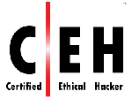

# My Certifications

Below I have included a list of certifications that I have attained over the past few years.
Many of these certs required passing more than one test. I have included a short summary of each certification along with a link to a better explanation of each one.

- [My Certifications](#my-certifications)
    - [CompTIA Security+](#comptia-security)
    - [Certified Ethical Hacker (C|EH)](#certified-ethical-hacker-ceh)
    - [Zend Certified PHP Engineer (ZCPE)](#zend-certified-php-engineer-zcpe)
    - [CompTIA Network+](#comptia-network)
    - [CIW Web Development Professional](#ciw-web-development-professional)
    - [CIW Database Design Specialist](#ciw-database-design-specialist)
    - [CIW Perl Specialist](#ciw-perl-specialist)
    - [CIW JavaScript Specialist](#ciw-javascript-specialist)
    - [CompTIA Linux+](#comptia-linux)
    - [SUSE Certified Linux Administrator 11](#suse-certified-linux-administrator-11)
    - [LPIC-1](#lpic-1)
    - [CompTIA A+](#comptia-a)

### CompTIA Security+

The CompTIA Security+ certification addressed many IT security subjects such as: cryptography, network security, compliance, threats, access control, etc. This was a very good introduction to security subjects as they relate to computers and networks.

[About Certification](https://certification.comptia.org/certifications/security)

### Certified Ethical Hacker (C|EH)
The Certified Ethical Hacker certification covered many areas of computer security including: footprinting, scanning, enumeration, penetration testing, SQL injection, etc. By gaining a better understanding of the tactics use by ethical hackers, I acquired valuable information to facilitate building better defenses and more secure web applications.

[About Certification](https://www.eccouncil.org/Certification/certified-ethical-hacker)

### Zend Certified PHP Engineer (ZCPE)
The Zend Certified PHP Engineer certification required exhaustive knowledge of the PHP language. Many of the areas that were tested included: functions, arrays, object oriented programming, security, strings, program logic, error detection, debugging, etc.
[Josh Young - ZCPE](https://www.zend.com/en/yellow-pages/ZEND024785)
[About Certification](https://www.zend.com/en/services/certification/php-certification)

### CompTIA Network+
The CompTIA Network+ certification required knowledge in many network related areas. Here are a few of the subjects covered: routing, network topologies, virtualization, network segmentation, switch port security, user authentication, firewalls, network access control, etc.

[About Certification](https://certification.comptia.org/certifications/network)

### CIW Web Development Professional
The CIW Web Development Professional certification was awarded as a result of achieving the following certifications: CIW JavaScript Specialist, CIW Perl Specialist, and CIW Database Design Specialist.
[About Certification](http://www.ciwcertified.com/certifications/Web_Development_Series/development.php)

### CIW Database Design Specialist
The CIW Database Design Specialist certification covered many areas of database design and optimization including: planning, relational algebra, design methodology, normalization, Structured Query Language (SQL), database security, etc.
[About Certification](http://www.ciwcertified.com/Certifications/Web_Development_Series/database_design.php)

### CIW Perl Specialist
The CIW Perl Specialist certification required knowledge in the following areas of the Perl language: loops, regular expressions, the interpreter, hashes, subroutines, reading/writing data, modules, object oriented programming techniques, database interaction, debugging, etc.
[About Certification](http://www.ciwcertified.com/Certifications/Web_Development_Series/perl.php)

### CIW JavaScript Specialist
The CIW JavaScript Specialist certification covered the JavaScript language
including topics such as: program flow, debugging, validation, DOM manipulation, libraries, AJAX, JavaScript security, libraries, etc.
[About Certification](http://www.ciwcertified.com/Certifications/Web_Development_Series/javascript.php)

### CompTIA Linux+
The CompTIA Linux+ certification required a very thorough knowledge of Linux. Here are just a few of the knowledge areas: file systems, run levels, package management, file management, process manipulation, command line regular expressions, scripting, security, shells, network configuration, and scheduled task configuration.

[About Certification](https://certification.comptia.org/certifications/linux)

### SUSE Certified Linux Administrator 11

[About Certification](https://training.suse.com/certification/sca-linux)

### LPIC-1
The LPIC-1 certification was all about Linux fundamentals. It covered many Linux areas including: symbolic links, permissions, disk management, file system integrity, process execution, GNU commands, libraries, boot loader configuration, etc.
[About CompTIA Certification](https://certification.comptia.org/certifications/linux)
[About LPIC Certification](https://www.lpi.org/certification/get-certified-lpi/lpic-1-linux-server-professional)

### CompTIA A+
The CompTIA A+ certification required knowledge in many areas of computer hardware including: BIOS configuration, motherboards, RAM, installation and configuration of computers and peripherals, network cable types, TCP/IP, TCP/UDP ports, networking tools, and troubleshooting.

[About Certification](https://certification.comptia.org/certifications/a)
